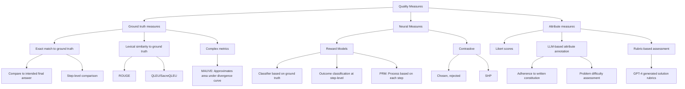
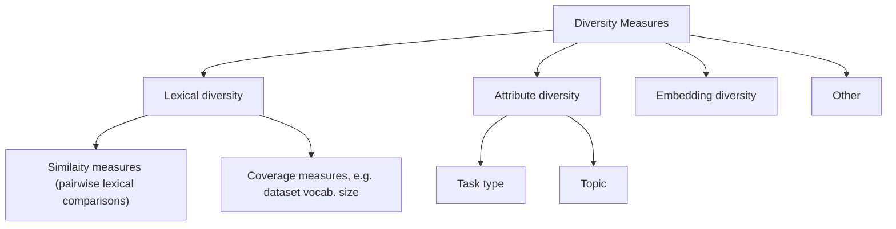
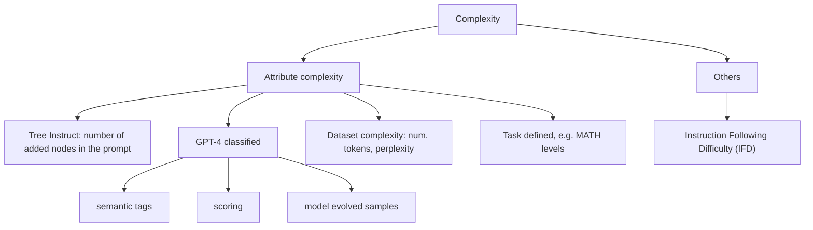

```mermaid
graph TD
%%    Ground truth
    Q[Quality Measures] --> Q1[Ground truth measures]
    Q1 --> Q1a[Exact match to ground truth]
    Q1a --> Q1a1[Compare to intended final answer]
    Q1a --> Q1a2[Step-level comparison]
    Q1 --> Q1b[Lexical similarity to ground truth]
    Q1b --> Q1b1[ROUGE]
    Q1b --> Q1b2[QLEU/SacreQLEU]
    Q1 --> Q1c[Complex metrics]
    Q1c --> Q1c1[MAUVE: Approximates area under divergence curve]
    
    Q[Quality Measures] --> Q2[Neural Measures]
    Q2 --> Q2a[Reward Models]
    Q2a --> Q2a1[Classifier based on ground truth]
    Q2a --> Q2a2[Outcome classification at step-level]
    Q2a --> Q2a3[PRM: Process based on each step]
    Q2 --> Q2b[Contrastive]
    Q2b --> Q2b1[Chosen, rejected]
    Q2b --> Q2b2[SHP]
    
    Q --> Q3[Attribute measures]
    Q3 --> Q3a[Likert scores]
    Q3 --> Q3b[LLM-based attribute annotation]
    Q3b --> Q3b1[Adherence to written constitution]
    Q3b --> Q3b2[Problem difficulty assessment]
    Q3 --> Q3c[Rubric-based assessment]
    Q3c --> Q3c1[GPT-4 generated solution rubrics]
```

```mermaid
graph TD
    D[Diversity Measures] --> D1[Lexical diversity]
    D1 --> D1a["Similaity measures (pairwise lexical comparisons)"]
    D1 --> D1b[Coverage measures, e.g. dataset vocab. size]
    
    D[Diversity Measures] --> D2[Attribute diversity]
    D2 --> D2a[Task type]
    D2 --> D2b[Topic]
    
    D[Diversity Measures] --> D3[Embedding diversity]
    D --> D4[Other]
```

```mermaid
graph TD
    C[Complexity] --> C1[Attribute complexity]
    C1 --> C1a[Tree Instruct: number of added nodes in the prompt]
    
    C1 --> C1b[GPT-4 classified]
    C1b --> C1b1[semantic tags]
    C1b --> C1b2[scoring]
    C1b --> C1b3[model evolved samples]
    
    C1 --> C1c[Dataset complexity: num. tokens, perplexity]
    
    C1 --> C1d[Task defined, e.g. MATH levels]
    
    C[Complexity] --> C2[Others]
    C2 --> C2a["Instruction Following Difficulty (IFD)"]
```